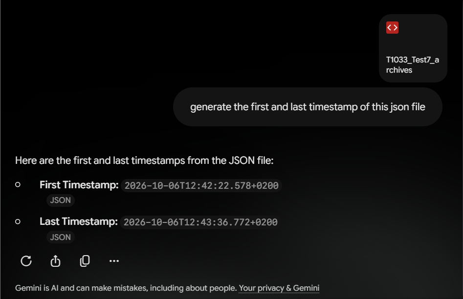
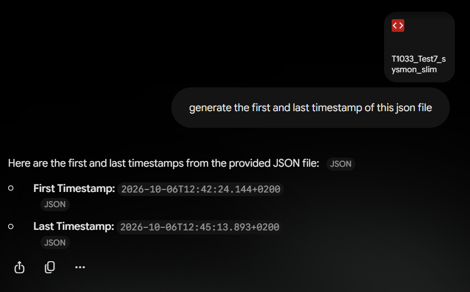
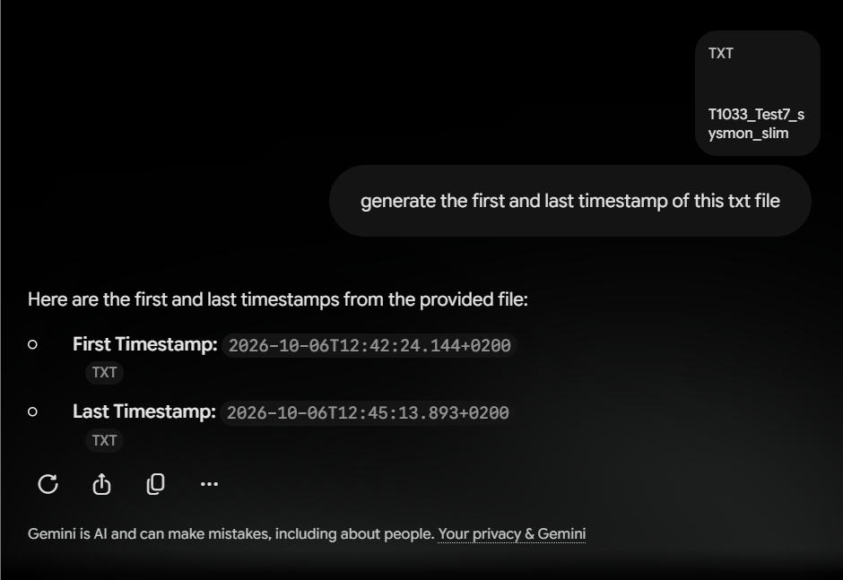

# Pilot Testing – Gemini Evidence Processing Limitation

During the T1033 pilot, Gemini repeatedly returned incorrect final timestamps when analysing the supplied Wazuh/Sysmon evidence.

Several attempts were made to address the issue, including removing redundant full-log entries, reducing metadata and simplifying the evidence into a smaller JSON file containing 406 Sysmon events.

The smallest file was approximately 382 KB. Gemini incorrectly identified the final timestamp as 12:45:13.893, corresponding to record 301 of 406. The actual final timestamp was 12:51:58.239.

The file was also submitted in TXT format, but Gemini returned the same incorrect result.

These repeated failures raised concerns about Gemini's reliability in processing complete evidence packages. As a result, the decision was made to replace Gemini with Grok before formal evaluation commenced.