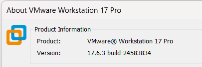
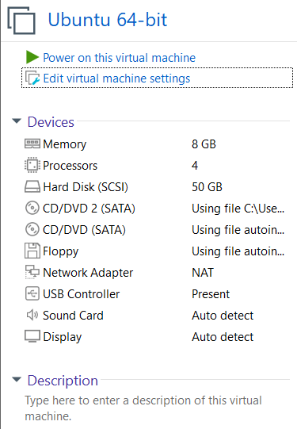
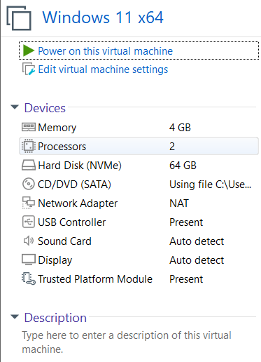

# Virtual Machine Environment

The experimental environment was created using VMware Workstation Pro. 
Two virtual machines were configured: a Windows 11 VM to act as the monitored endpoint and an Ubuntu VM to host the Wazuh platform.

## VMware Workstation Pro

VMware Workstation 17 Pro was used to create and manage the virtual laboratory.

- Version: 17.6.3
- Build: 24583834

## Ubuntu Virtual Machine

The Ubuntu virtual machine was configured to host the Wazuh security monitoring environment.

Configuration:

- Memory: 8 GB
- Processors: 4
- Storage: 50 GB
- Network Adapter: NAT

## Windows Virtual Machine

The Windows 11 virtual machine was configured as the monitored endpoint. 
Sysmon and the Wazuh agent are installed on this machine to collect security telemetry during the attack scenarios.

Configuration:

- Operating System: Windows 11 x64
- Memory: 4 GB
- Processors: 2
- Storage: 64 GB
- Network Adapter: NAT

