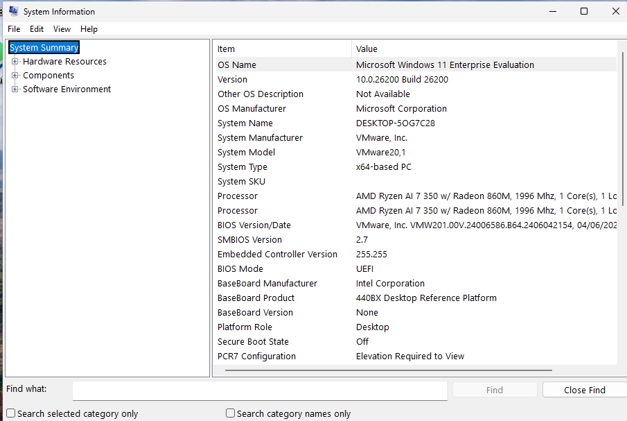
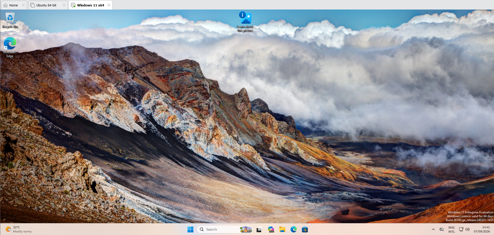

# Windows Virtual Machine

A Windows 11 virtual machine was installed and configured as the monitored endpoint for the project.

The VM is used to run controlled attack scenarios and generate security telemetry that can be collected by Sysmon and Wazuh.

## Configuration

- Operating System: Windows 11 Enterprise Evaluation
- Version: 10.0.26200
- Build: 26200
- System Type: x64-based PC
- Memory: 4 GB
- Processors: 2
- Storage: 64 GB
- Network Adapter: NAT

## Installation

The screenshot below confirms the successful installation of Windows 11 within the lab.

## Operational Check

The Windows VM was successfully started and confirmed to be working successfully before installing and configuring the required security monitoring tools.

