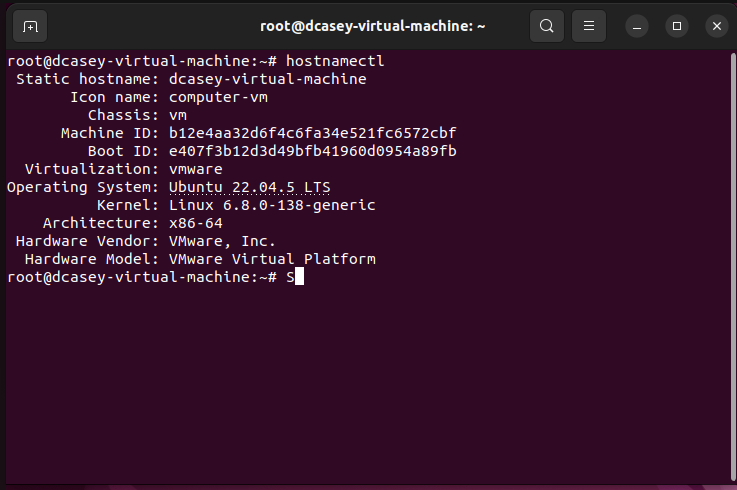
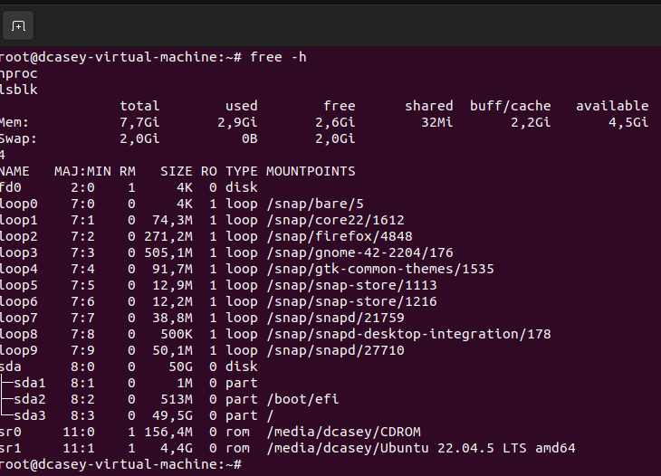
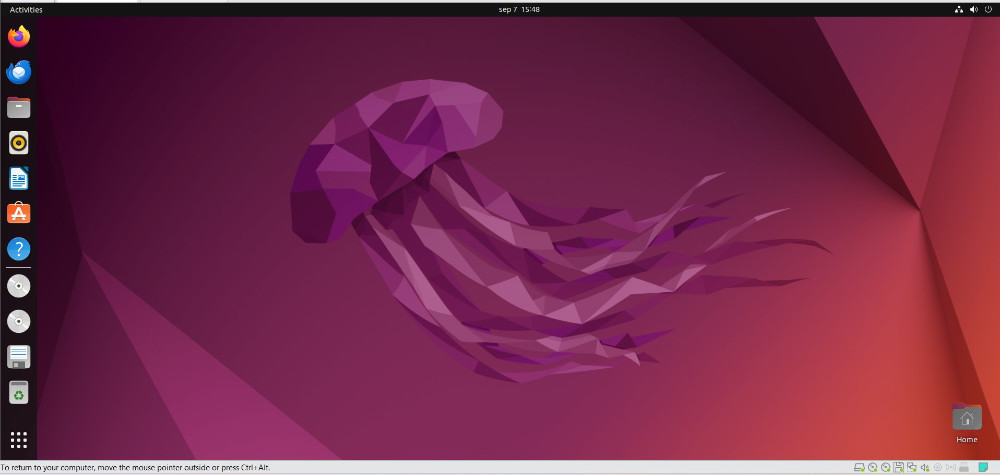

# Ubuntu VM

An Ubuntu virtual machine was installed and configured to host the Wazuh security monitoring platform used within the project.

The Ubuntu VM provides the server environment required to run Wazuh and receive security data from the Windows endpoint.

## System Information

The Ubuntu VM was configured with Ubuntu 22.04.5 LTS running within VMware Workstation Pro.

- Operating System: Ubuntu 22.04.5 LTS
- Kernel: Linux 6.8.0-138-generic
- Architecture: x86-64
- Virtualisation Platform: VMware

## System Resources

The VM was allocated sufficient resources to support the Wazuh installation and security monitoring environment.

- Memory: 8 GB
- Processors: 4
- Storage: 50 GB
- Network Adapter: NAT

The screenshot below confirms the available memory and storage configuration within Ubuntu.

## Operational Check

The Ubuntu virtual machine was successfully installed and confirmed to be operational before the configuration of Wazuh.

