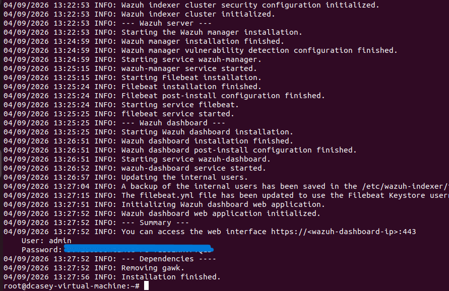
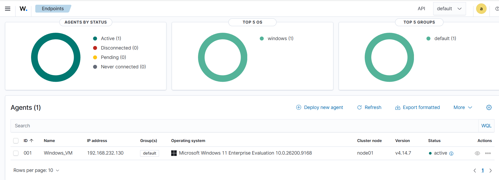
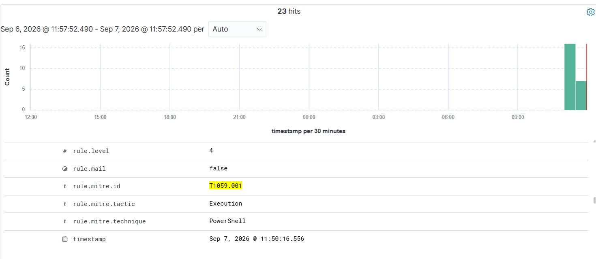

# Wazuh

Wazuh was installed on the Ubuntu virtual machine and configured as the security monitoring platform for the project. The Windows 11 virtual machine was connected to Wazuh using the Wazuh agent. This allows security events generated on the Windows endpoint, including Sysmon telemetry, to be collected and analysed by Wazuh.

## Wazuh Installation

The Wazuh platform was installed on the Ubuntu VM. The installation included the Wazuh manager, indexer, Filebeat and dashboard components.

The screenshot below confirms that the Wazuh installation completed successfully and that the required services were started.

## Windows Agent Deployment

The Wazuh agent was installed on the Windows 11 virtual machine and configured to communicate with the Wazuh manager.

The Wazuh agent service was successfully started following installation.

## Windows Agent Connection

The Windows endpoint was successfully connected to the Wazuh server.

- Agent Name: Windows_VM
- Operating System: Windows 11 Enterprise Evaluation
- Wazuh Agent Version: 4.14.7
- Status: Active

The Wazuh dashboard confirmed that the Windows endpoint was actively connected and communicating with the server.

## Sysmon and MITRE ATT&CK Verification

Wazuh was verified as receiving and analysing Sysmon telemetry from the Windows endpoint.

The screenshot below shows a Wazuh event mapped to MITRE ATT&CK technique **T1059.001 - PowerShell**, confirming that security events generated on the Windows VM can be processed by Wazuh.

## Raw Sysmon Event Verification

Raw Sysmon event data was also verified within the Wazuh environment. This confirms that detailed endpoint telemetry is available for collection and later use as evidence during the LLM investigations.

The raw event data contains information including process names, command-line activity, parent processes, users and timestamps.

