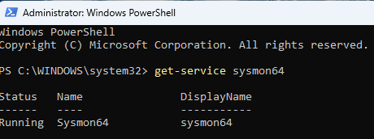
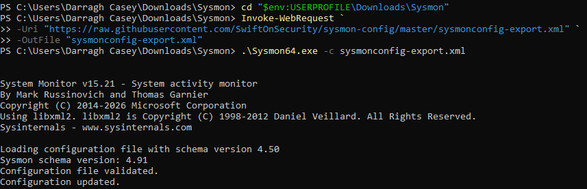
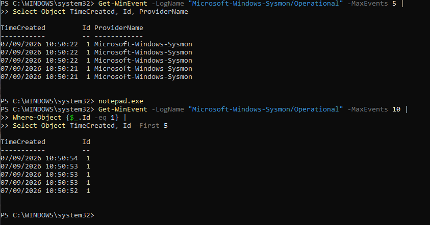
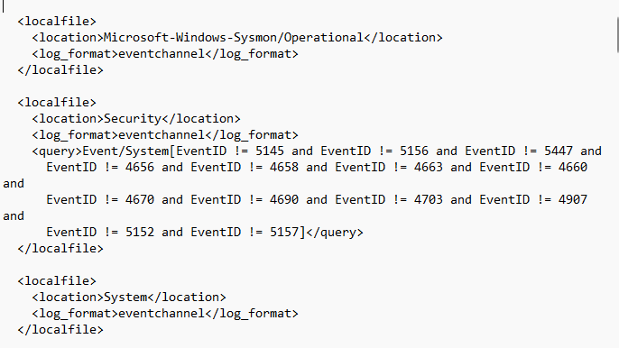

# Sysmon

Sysmon was installed and configured on the Windows 11 virtual machine to provide detailed endpoint telemetry for the project. Sysmon records security-relevant activity occurring on the Windows endpoint. This telemetry is collected by Wazuh and will later form part of the evidence provided to the LLMs during the investigation scenarios.

## Sysmon Installation and Status

The Sysmon service was installed on the Windows 11 virtual machine and verified as running.

- Sysmon Version: 15.21
- Service: Sysmon64
- Status: Running

A Sysmon configuration based on the SwiftOnSecurity configuration was downloaded and applied to the installation.

## Sysmon Configuration

The Sysmon configuration file was successfully applied using Sysmon64.

The configuration was validated before being loaded and Sysmon confirmed that the configuration was successfully updated.

## Event Collection Verification

Sysmon event collection was tested using PowerShell.

Recent events from the `Microsoft-Windows-Sysmon/Operational` log were queried and Process Creation events (Event ID 1) were successfully returned.

Notepad was then executed as a simple test process and additional Event ID 1 events were generated, confirming that Sysmon was actively recording process creation activity.

## Wazuh Sysmon Configuration

The Wazuh agent was configured to collect events from the Sysmon Operational event channel.

The following Windows event channel was added to the Wazuh configuration:

`Microsoft-Windows-Sysmon/Operational`

The event data is collected using the `eventchannel` log format, allowing Sysmon telemetry generated on the Windows endpoint to be forwarded to Wazuh.

