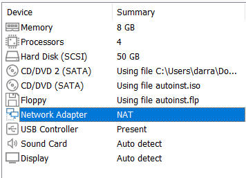
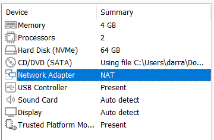
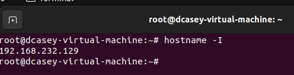
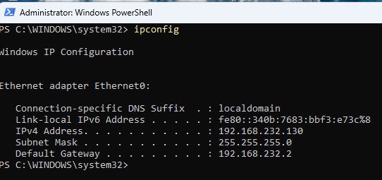
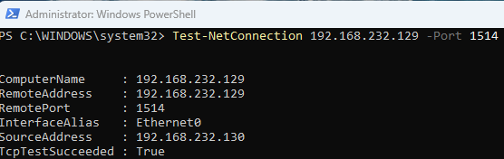

# Network Configuration

The Windows and Ubuntu virtual machines were configured on the same VMware NAT network to allow communication between the monitored Windows endpoint and the Wazuh server. This network configuration allows the Windows VM to send security data to the Wazuh environment hosted on the Ubuntu VM.

## Ubuntu VM Network Configuration

The Ubuntu virtual machine was configured to use a VMware NAT network adapter.

## Windows VM Network Configuration

The Windows 11 virtual machine was also configured to use a VMware NAT network adapter. Using the same NAT network allows both virtual machines to communicate within the virtual lab environment.

## Ubuntu VM IP Address

The Ubuntu VM was assigned the following IP address:

`192.168.232.129`

This address is used by the Windows endpoint to communicate with the Wazuh server.

## Windows VM IP Address

The Windows VM was assigned the following network configuration:

IP Address: `192.168.232.130`
Subnet Mask: `255.255.255.0`
Default Gateway: `192.168.232.2`

## Wazuh Connectivity Verification

Connectivity between the Windows endpoint and the Wazuh server was tested using PowerShell.

A connection test was performed from the Windows VM to the Ubuntu VM on TCP port `1514`.

The test returned:

`TcpTestSucceeded : True`

This confirmed that the Windows endpoint could successfully communicate with the Wazuh server on the required port.

