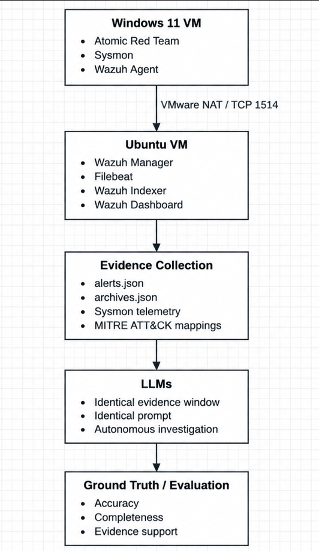

# Project Architecture

This folder contains the architecture diagram for the experimental environment used within the project. The architecture shows how attack activity is generated on the Windows 11 virtual machine, collected through Sysmon and the Wazuh agent, transferred to the Wazuh environment and prepared as evidence for the LLM investigations.

## Architecture Overview

The environment consists of:

- Windows 11 VM containing Atomic Red Team, Sysmon and the Wazuh agent.
- Ubuntu VM hosting the Wazuh Manager, Filebeat, Wazuh Indexer and Wazuh Dashboard.
- VMware NAT networking used for communication between the two virtual machines.
- Wazuh alerts and raw Sysmon telemetry used as investigation evidence.
- Identical evidence and prompts provided to each selected LLM.
- LLM investigation results compared against a predefined ground truth.
- Evaluation based on accuracy, completeness and evidence support.

