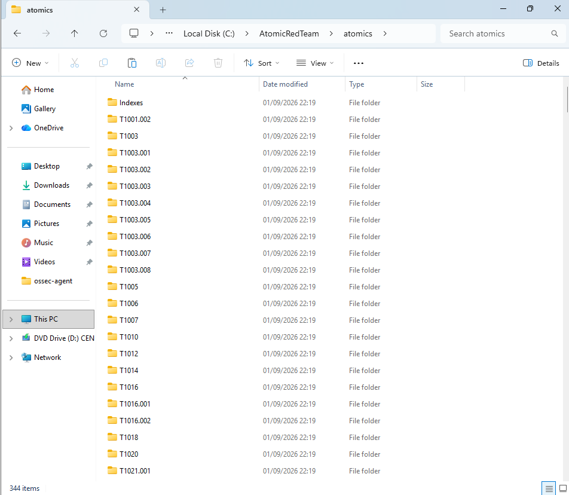
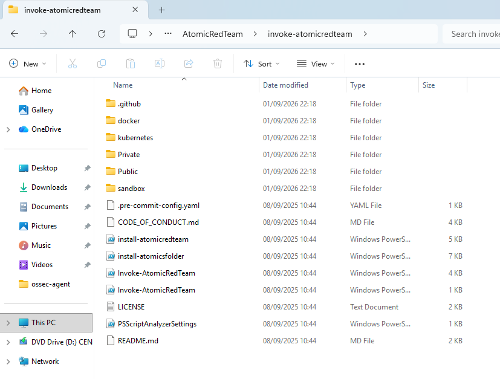
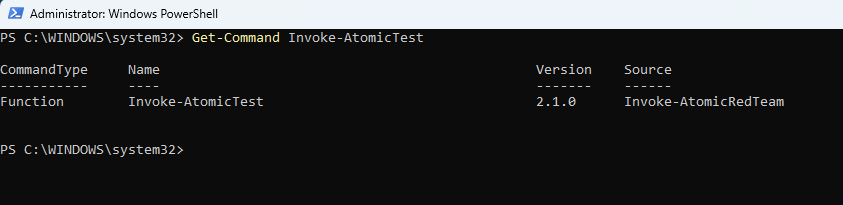
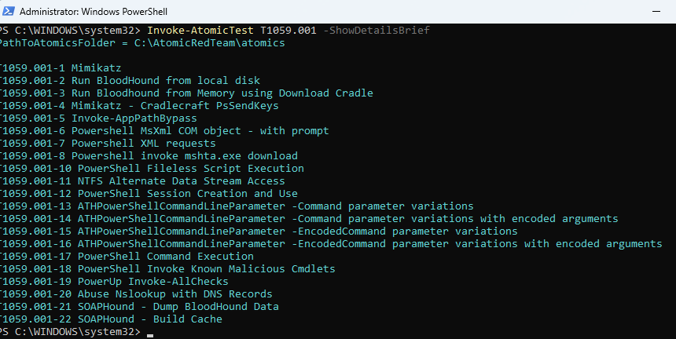

# Atomic Red Team Setup

Atomic Red Team was installed on the Windows 11 virtual machine to generate controlled attack activity for the experimental scenarios. The Invoke-AtomicRedTeam PowerShell module and Atomic Red Team test library were installed and verified before selecting and executing the attack scenarios.

## Atomic Test Library

The Atomic Red Team test library was installed under:

`C:\AtomicRedTeam\atomics`

The library contains individual folders organised by MITRE ATT&CK technique ID.

## Invoke-AtomicRedTeam Module

The Invoke-AtomicRedTeam PowerShell module was installed alongside the Atomic test library.

## Module Verification

The installation was verified using the `Get-Command Invoke-AtomicTest` command.

The command confirmed that `Invoke-AtomicTest` was available through the Invoke-AtomicRedTeam module.

## Test Availability Verification

Available tests for MITRE ATT&CK technique T1059.001 - PowerShell were queried using:

`Invoke-AtomicTest T1059.001 -ShowDetailsBrief`

The command successfully returned the available PowerShell Atomic tests, confirming that the Atomic Red Team environment was ready for scenario selection.

